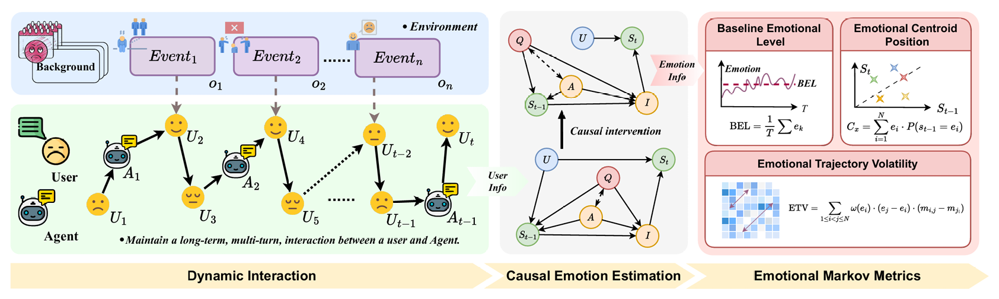

<div align="center">
 <picture>
    <source media="(prefers-color-scheme: light)" srcset="README/asserts/ETrajEval_logo_white.png">
    <source media="(prefers-color-scheme: dark)" srcset="README/asserts/ETrajEval_logo_black.png">
    
    </picture>
  <br/>
  <p>
    <!-- <a href="?"></a> -->
    <!-- <a href="?"></a> -->
    <a href="https://pypi.org/project/rewardanything/"></a>
    </p>

  # Detecting Emotional Dynamic Trajectories: An Evaluation Framework for Emotional Support in Language Models

  <a>Zhouxing Tan<sup>1</sup></a>&emsp;
  <a>Ruochong Xiong<sup>1</sup></a>&emsp;
  <a>Yulong Wan<sup>1</sup></a>&emsp;
  <a>JinLong Ma<sup>2</sup></a>&emsp;
  <a>Hanlin Xue<sup>1</sup></a>&emsp;
  <a>Qichun Deng<sup>2</sup></a>&emsp;
  <a>Haifeng Jing<sup>1</sup></a>&emsp;
  <a>Zhengtong Zhang<sup>2</sup></a>&emsp;
  <a>Depei Liu<sup>1</sup></a>&emsp;
  <a>Shiyuan Luo<sup>2</sup></a>&emsp;
  <a> Junfei Liu<sup>1,†</sup></a>
  <div>
    <br/>
    <p>
      <sup>1</sup>National Engineering Research Center For Software Engineering, Peking University&emsp;
      <sup>2</sup>Guangzhou Quwan Network Technology
    </p>
    <p><sup>†</sup>Corresponding author.</p>
  </div>
</div>


This repository hosts **ETrajEval**, the official framework from our paper, **“Detecting Emotional Dynamic Trajectories: An Evaluation Framework for Emotional Support in Language Models.”**

Traditional evaluation methods for emotional support often rely on short, static dialogues, assessing model responses in isolated "snapshots." This approach fails to capture the essential nature of effective support, which unfolds over time and requires adapting to a user's evolving emotional state.

To overcome this, **ETrajEval** shifts from static, model-centric evaluation to **dynamic, user-centered trajectory analysis**. We simulate realistic, multi-turn role-playing scenarios where a user's emotional state is influenced by the conversation and by external "disturbance events." Our framework evaluates a model's ability not just to produce a single empathetic response, but to consistently **improve and stabilize a user's emotional well-being over the entire course of an interaction.**


<p align="center">
  
  <br>
  <em>Figure 1: Overview of the ETrajEval framework, including dynamic interaction, causal emotion estimation, and trajectory-based metrics.</em>
</p>

## 🙂 Language

<center> 

English | [Chinese](README/README_ZH.md)  

</center>

## 🌟 Key Features

-   🧠 **Dynamic, Long-Term Evaluation**: Simulates conversations up to 40 turns long to assess sustained emotional support, moving beyond single-turn Q&A.
-   📈 **User-Centered Trajectory Metrics**: Introduces three novel metrics to quantify emotional dynamics:
    -   **BEL (Baseline Emotional Level)**: The user's average emotional state during the interaction.
    -   **ETV (Emotional Trajectory Volatility)**: The model's efficiency in elevating negative emotions and providing resilience against decline.
    -   **ECP (Emotional Centroid Position)**: The overall direction and stability of emotional transitions.
-   🌍 **Realistic Simulation Environment**: Built on a large-scale benchmark of **328 emotional contexts** and **1,152 disturbance events**, grounded in established psychological theories.
-   🔬 **Causally-Adjusted Scoring**: Employs causal inference techniques to obtain an unbiased, robust estimation of the user's emotional state, mitigating the influence of confounding factors.
-   🔧 **Configurable & Extensible**: Easily configure and compare different models (local or API-based) using a single YAML file.
-   📊 **Comprehensive Analysis**: Generates detailed, turn-by-turn scoring data and aggregated results, providing deep insights into model performance.

## 🚀 Quick Start

### 1. Setup

First, clone the repository and set up the environment.

```bash
# Clone the repository
git clone https://github.com/your-username/ETrajEval.git
cd ETrajEval

# Create and activate a virtual environment
python -m venv venv
source venv/bin/activate

# Install dependencies
pip install -r requirements.txt
```

**Note on PyTorch**: For GPU support, please install the PyTorch version that matches your system's CUDA toolkit. Visit the [official PyTorch website](https://pytorch.org/get-started/locally/) to find the correct command.

### 2. Download Models

The framework requires a reward model for the scoring phase. Download the model specified in your config file and update the path. For example:

```bash
# Example: Download a reward model from Hugging Face
# You'll need to have git-lfs installed: https://git-lfs.com
git clone https://huggingface.co/Skywork/Skywork-Reward-V2-Llama-3.1-8B /path/to/your/models/Skywork-Reward-V2-Llama-3.1-8B
```

### 3. Configure Your Evaluation

Modify the `ETrajEval/config.yaml` file to set up your experiment. This is the central control file for the entire framework.

```yaml
# config.yaml

# Controls which phases to run
execution_phases:
  run_generation: true  # Phase 1: Simulate conversations
  run_scoring: true     # Phase 2: Score the generated conversations

# --- Configure Model 1 (e.g., your model to test) ---
model1:
  name: "My-Custom-Model-7B"
  type: "local" # 'local' for HuggingFace, 'api' for OpenAI-compatible
  path_or_name: "/path/to/your/models/My-Custom-Model-7B"
  gpu_indices: [0] # List of GPU indices to use
  generation_params:
    temperature: 1.0
    max_tokens: 512

# --- Configure Model 2 (common general chat models) ---
model2:
  name: "gpt-4-turbo"
  type: "api"
  model_name: "gpt-4-turbo-2024-04-09"
  api_config:
    api_key: "YOUR_API_KEY_HERE" # Or set as OPENAI_API_KEY env var
    base_url: "https://api.openai.com/v1"
  generation_params:
    temperature: 1.0
    max_tokens: 512

# --- Data and Scoring Configuration ---
data:
  prompt_file: "dataset/prompts.json" # Path to conversation scenarios

scoring:
  reward_model_device: "cuda:0"
  reward_model_path: "/path/to/your/models/Skywork-Reward-V2-Llama-3.1-8B"
  k_samples: 8
```

### 4. Run the Evaluation

Execute the main script with your configuration file. The framework will run the specified phases.

```bash
cd ETrajEval
python run.py --config config.yaml
```

-   **Generation Phase**: This will run the chat simulations between `model1` and `model2` based on the scenarios in `prompt_file`.
-   **Scoring Phase**: After generation (or using pre-existing logs), this phase will score the emotional trajectories in each conversation.

### 5. Analyze the Results

The results will be saved in the `output/` directory.

-   **Chat Logs**: `output/chat_logs/{model1_vs_model2}/chat_logs_{language}.json`
    -   Contains the full conversation transcripts for every scenario.
-   **Evaluation Results**: `output/eval_results/{model1_vs_model2}/eval_results_{language}.json`
    -   Contains comprehensive results, including overall summary scores, a breakdown by psychological theory, and detailed turn-by-turn scores for each conversation.

## 🔬 Core Concepts Explained

-   **Trajectory Metrics**: At the heart of ETrajEval are three metrics that together depict a model's supportive capability. **BEL** measures overall emotional positivity, **ETV** measures the model's ability to drive positive change, and **ECP** measures the stability and direction of that change.
-   **Disturbance Events**: To test model resilience, we inject pre-defined negative events into the conversation at specific turns. This simulates real-world emotional volatility and challenges the model to provide adaptive support.
-   **Psychological Grounding**: The conversation scenarios and model constraints are designed around established psychological principles, such as cognitive reappraisal and situation selection, ensuring the evaluation is clinically relevant.

## 🔧 Adding Your Own Models

Easily integrate new models by adding a definition in `config.yaml`:

-   **For a Local Hugging Face Model**:
    ```yaml
    model_new:
      name: "My-Mistral-Finetune"
      type: "local"
      path_or_name: "/path/to/my/mistral/finetune"
      gpu_indices: [1]
      generation_params: { ... }
    ```
-   **For an API-Based Model**:
    ```yaml
    model_new:
      name: "Claude-3-Opus"
      type: "api"
      model_name: "claude-3-opus-20240229"
      api_config:
        api_key: "YOUR_ANTHROPIC_KEY"
        base_url: "https://api.anthropic.com/v1"
      generation_params: { ... }
    ```

## 📄 Citation

If you use ETrajEval in your research, please cite our paper:

```bibtex
@article{anonymous2025et,
  title={Detecting Emotional Dynamic Trajectories: An Evaluation Framework for Emotional Support in Language Models},
  author={Anonymous},
  journal={Details to be updated upon publication},
  year={2025}
}
```

## 🤝 Contributing

We welcome contributions! Please feel free to open an issue or submit a pull request.

## 📝 License

This project is licensed under the Apache 2.0 License. See the [LICENSE](SECURITY.md) file for details.


